# Various Techniques to Build up a Fast-Running Electrical Model in Simulink and Simscape Electrical

This repository contains various small models to show different concepts that can be used to build up a fast-running electrical model in Simulink and Simscape Electrical  

All demos are based on MATLAB Live-Scripts that use a programmatic approach to change settings in the models. This should help users to reproduce the exact steps, even if most of those steps can be also done interactively.

## Description

All the demos are organized in the following way:  

Project: Fast Electrical Simulation
1.	Analysis Tools
2.	Overview Example
3.	Simulation Modes and Fast Restart
4.	Parallel Computing
5.	Model Fidelity  
  5.2. Phasor Mode Simulation  
  5.4. Converter  
  5.5. Battery
6.	Modeling Techniques  
  6.1. Fast PWM Simulation  
  6.2. Variable Frequency Pulse Generator
7.	Solver Overview
8. ...  
9.  Simscape To HDL

## 1) Analysis Tools

### Model and Performance Advisor
The Model Advisor is used to perform several performance checks for your specific model concerning non optimal model settings or blocks. It also suggests counter measures. 

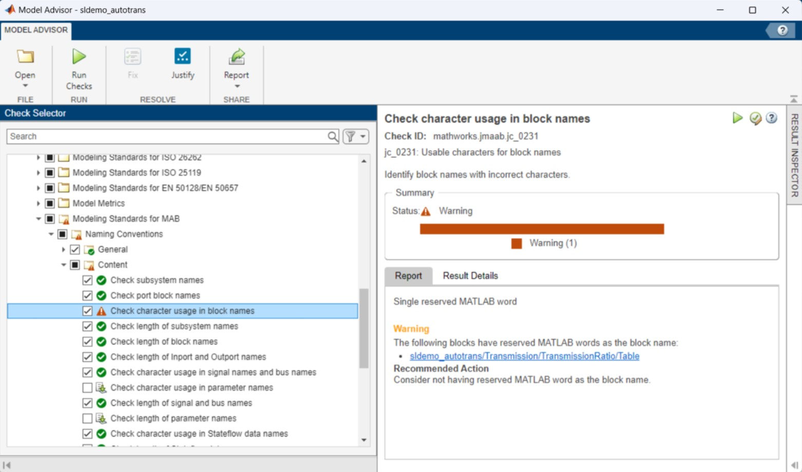

### SimulinkProfiler
The Simulink Profiler is used to figure out how much simulation time is needed for the whole model, per subsystem or per block. It works for normal and accelerator mode.

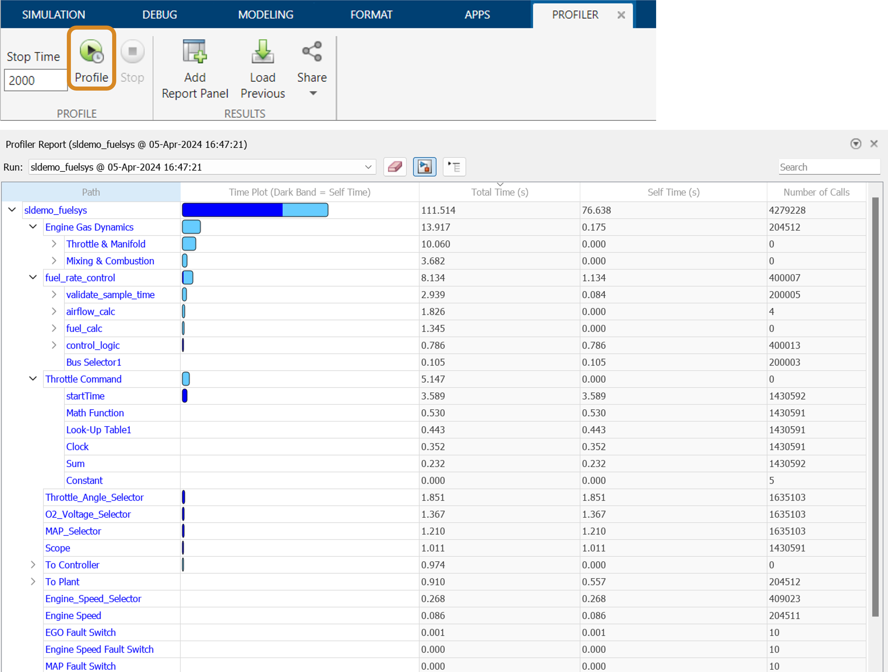

### Solver Profiler
The Solver Profiler helps to figure out performance bottlenecks for models using a variable step solver. It shows the step sizes used during simulation and shows what blocks are causing small step sizes. It shows solver exceptions, solver resets, zero crossings and Jacobian updates.

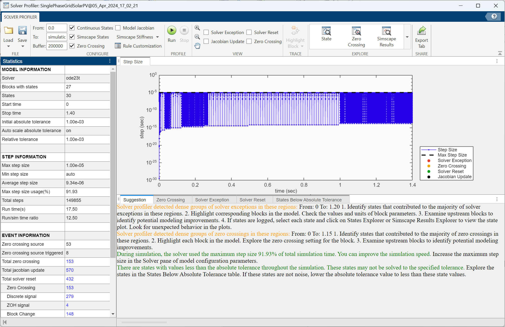

### Statistics Viewer
The Statistics Viewer will aggregate Simscape model statistics for a given model with its solver configurations. Use it to evaluate model statistics to analyse models containing blocks and investigate the model complexity.

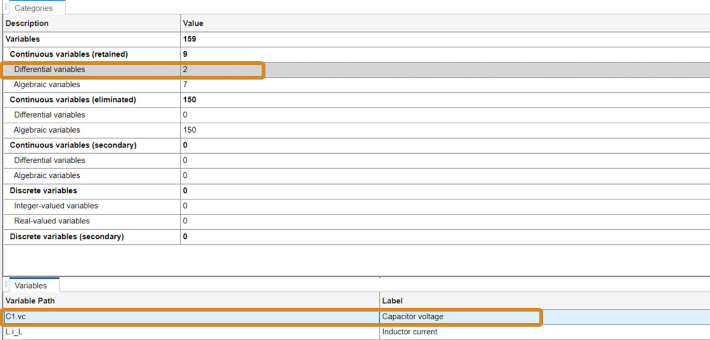

### Variable Scaling Analyzer
Scaling Simscape variables by their expected magnitude increases simulation robustness and performance. The techniques allows to provide a fine-tune scaling of variables in a Simscape model. 

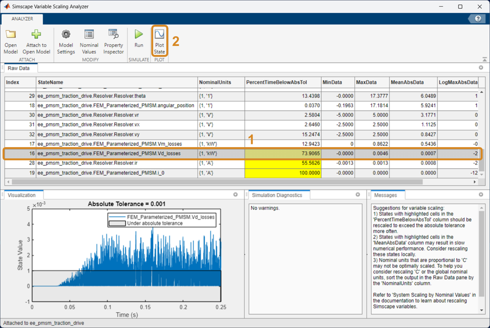

### Variable Viewer
The Variable Viewer can be used to check the results of the initialization for the model. It allows to check, if individual initial value targets for variables have been satisfied. Use the Variable Viewer to check the models’ initial conditions with their priorities, explore issues when model initialization fails or throws warnings. 

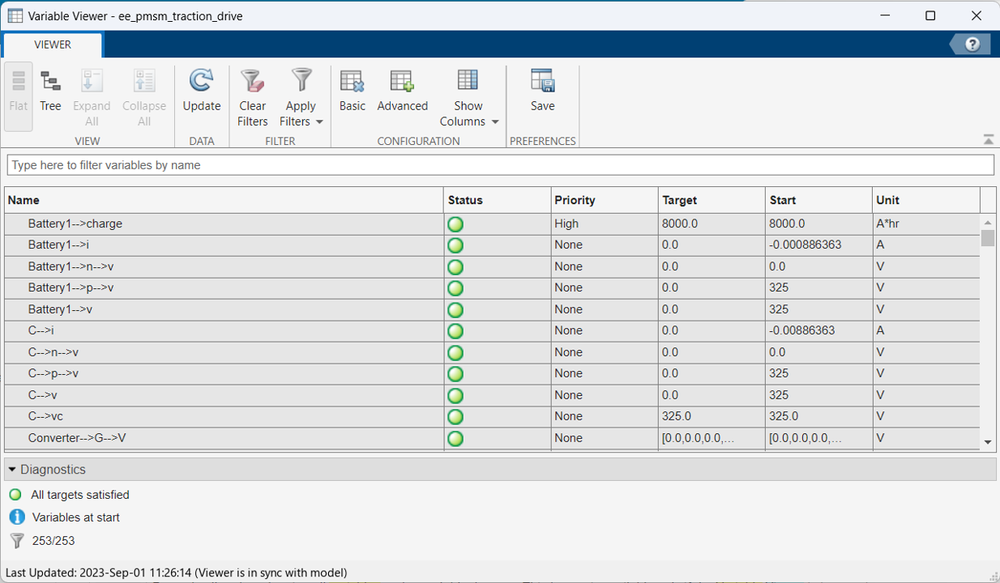

## 2) Overview Example
The Overview Example shows some typical performance bottlenecks in electrical system models like
- global fixed step solver
- no local solver for Simscape (only for fixed step)
- continuous PI controller
- many Scopes
- Slow PWM Implementation
- Normal Simulation Mode
- No Fast Restart
- Dedicated delays
- Detailed Power Electronics (IGBTs)
- No Parallel computing
Please watch the corresponding YouTube video, if you want to learn, how to analyze a model step-by-step.

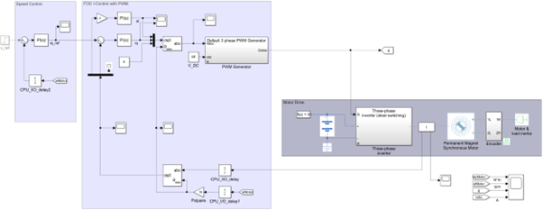

## 3) Simulation Modes and Fast Restart
This section shows what impact the various simulation modes have on electrical system model. These modes are Normal, Accelerator and Rapid Accelerator Mode.

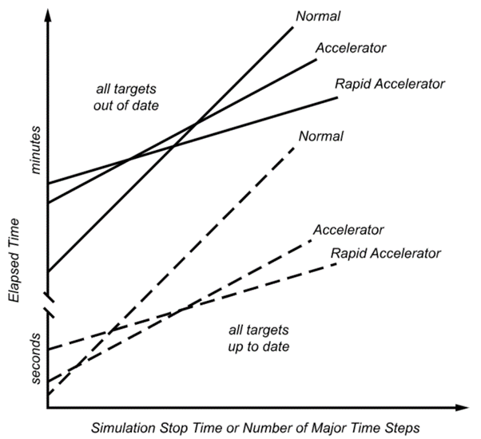

Additionally, the Fast Restart option is shown here.  Fast Restart will prevent the check for model updates and will prevent recompilation as long as only parameters and no structures are changed in the model.

Run the MATLAB Live Script "SimulationModes_FastRestart.mlx" to learn more about these features.

## 4) Parallel Computing
This section shows how you can speed up electrical Simulation with Parallel Computing in normal or accelerator mode.
Parallel Simulation can be used everywhere, where iterations are order independent. This is the case for 
- Parameter sweeps 
- Monte-carlo analysis
- Gradient calculation within local optimization problem
- Parallel calculations during global optimiuzation problem
- Model testing (Simulink Test)

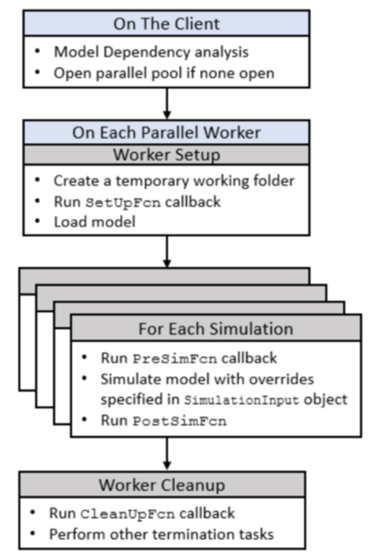

Run the MATLAB Live Script “ParallelSimulationSetup_NormalOrAccelerator.mlx” to learn more about these features.

## 5) Model Fidelity

This section describes how different model fidelity variants influence the execution speed of a model.

### 5.2) Phasor mode simulation 
This section compares a full electromagnetic transient (EMT) simulation of an AC power system to a phasor simulation. The requirements for a successful phasor mode simulation are shown, as well as how to switch the solver to phasor (called frequency and time). 

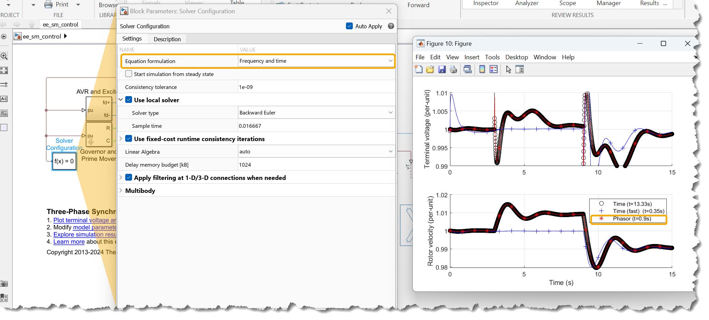

Run the MATLAB Live Script “PhasorModeSimulationExample.mlx” to learn more about these features.

### 5.4) Model Fidelity of Converters
This section compares different model fidelity variants for power converters, like averaged, ideal switching and detailed converters. It shows when you have to use which converter variant and how fast they run in comparison.

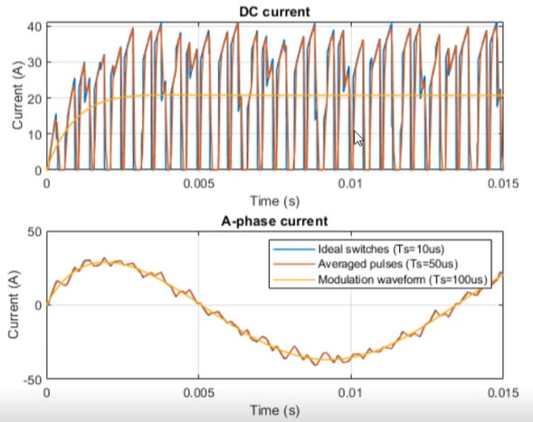

Run the MATLAB Live Script “Converter_Avrg_Ideal_Detailed_Subcycle.mlx” to learn more about these features.

### 5.5) Model Fidelity with Simscape Battery
This section compares two battery packs with different model fidelity. Subsequently, the results are compared in terms of calculation time.

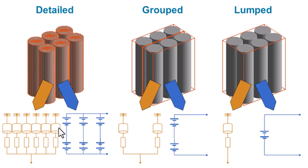

Run the MATLAB Live Script “SimscapeBattery.mlx” to learn more about these features.

## 6) Modeling Techniques
This section describes how pulse generators for Pulse Width Modulation (PWM) and for variable frequency converters can be modeled efficiently.

### 6.1) Fast PWM Simulation
This chapter shows what you must consider when you build up a model with fast PWM switching. It will show the dependency of execution speed from the solver selection, the converter fidelity variants and from different PWM block implementations. 

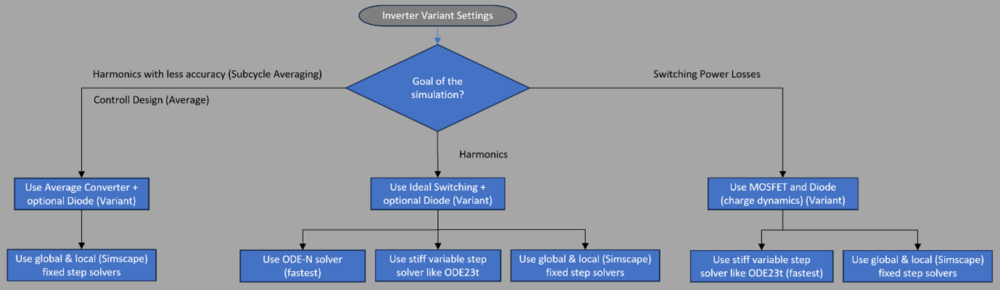

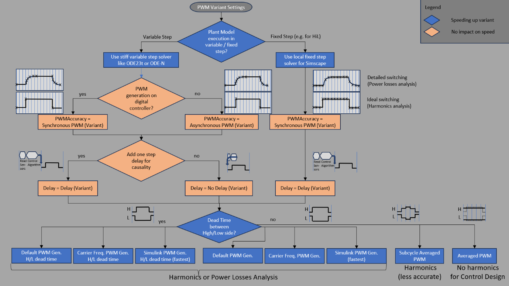

Run the MATLAB Live Script “FastPWMsimulation.mlx” to learn more about these features.

### 6.2) Variable Frequency Pulse Generation
This chapter shows techniques to model a fast implementation of variable frequency pulse generator for variable frequency converters.

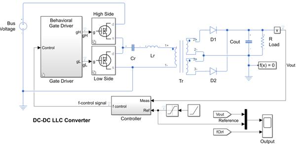

Run the MATLAB Live Script “VariableFrequencyConverter.mlx” to learn more about these features.

## 7) Solver Overview
This chapter gives an overview on solver and model considerations when simulating physical networks. 

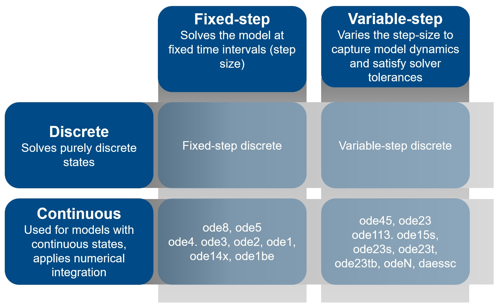

## 9) Simscape to HDL
To run this chapter, please first start “PMSM_FPGA_HIL_Demo.prj” inside the corresponding folder “_9_SimscapeToHDL”.  
Please see [this in-product example](https://www.mathworks.com/help/hdlcoder/ug/generate-hdl-code-for-simscape-models-using-linearized-switch-approximation.html) for an introduction to this method. This demo project extends the previous example comparing different approaches, and adding further steps for code generation and deployment to complete a full workflow for FPGA-based HIL.
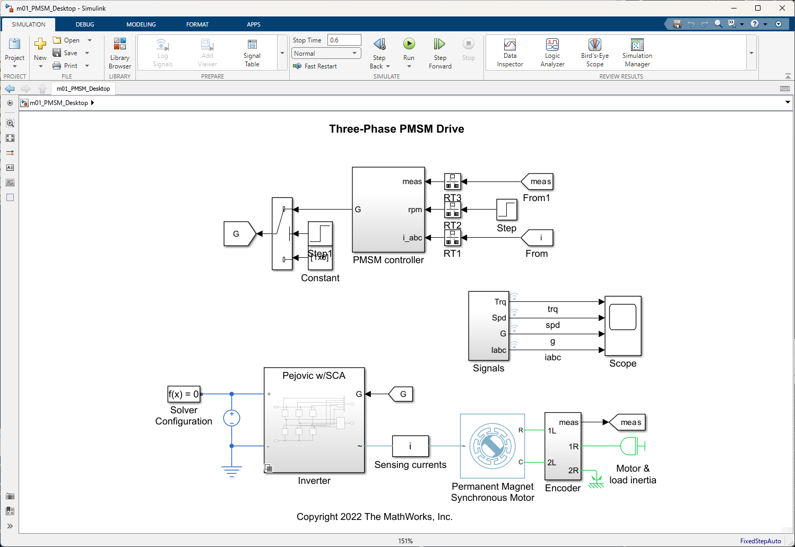

### Important technical background
Pejovic's method replaces the Simscape switches and diodes with a combination of linear Simscape blocks and Simulink switches that will enable a conversion to a LTI (linear time-invariant) model. This method works with any solver, it has been tested with backward Euler and partitioning solver. This sample project features the latter but Pejovic and its implementation library is not restricted to that application and can be used with other converters and network topologies, please see the model `TwoLevelConverterIdealExample_Pejovic` for another simple example.
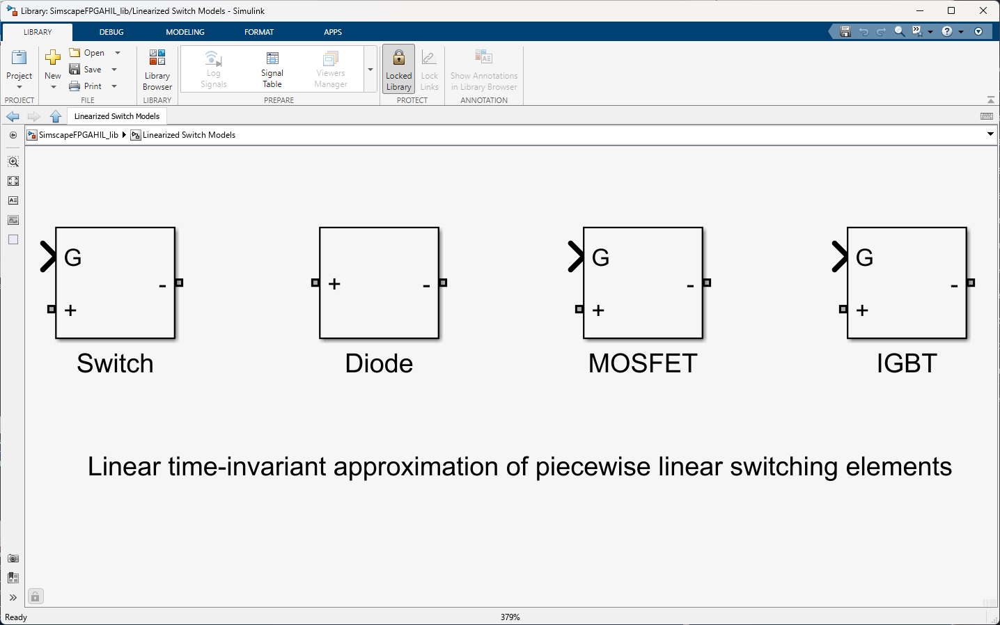

This project shows the different manual steps for the transformation of a Simscape model to an HDL-optimized Simulink model. In a later MATLAB Release, the Pejovic replacement of switches in a Simscape network may become automated.

See the original Pejovic's [paper](https://ieeexplore.ieee.org/document/318904) for further technical reference.

### Fixed-point optimization
To enable further optimization of timing and resources on FPGA, the model TwoLevelConverterIdealExample_HDL implements a variant using the [Fixed-Point State-Space block](https://www.mathworks.com/help/simulink/slref/fixedpointstatespace.html) with the input data obtained from the Simscape to HDL Workflow Advisor. Using the built-in block simplifies the eventual conversion of the HDL model to fixed-point w.r.t. the HDL subystem automatically built by the advisor.

### Subcycle Averaging
As a proof of concept, the Simscape Pejovic Switch library has been extended with a linear averaged switch subsystem that interpolates linearly between the extreme values feeding the switch block in the standard built-in implementation. The subcycle averaging logic used is optimized for HDL code generation and is therefore suitable for very high frequency switching applications.
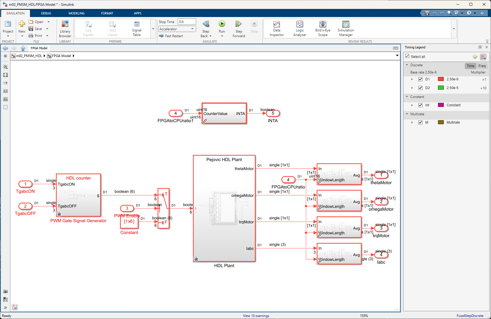

### Special Instructions
Please open the live scripts from the shortcut toolstrip or the liveScripts folder for more detailed and step-by-step instructions.

### Contact
Pablo Romero, promero@mathworks.com

### Relevant Industries
All, electrification, power electronics.

### Relevant Products for "Simscape To HDL"
- Simulink Real-Time
- HDL Coder
- Simscape Electrical
- Speedgoat IO334 HDL Coder Integration Package
  
    
      
        
          
          
## Installation
The model was developed using MATLAB release R2023b and requires the following products:
- MATLAB®
- Simulink®
- Simscape™
- Simscape Battery™
- Simscape Electrical™
- Parallel Computing Toolbox™

## Support
For any questions regarding the model place a comment in the repository.

## Authors
- Gernot Schraberger: 		Chapters 2,3,4 & 6
- Eva Pelster: 			    Chapters 1 & 7
- Nils Hornik: 			    Chapter 5.2
- Lorenzo Nicoletti			Chapter 5.5
- Pablo Romero Cumbreras 	Chapter 9 
- Hugo De Kock			    Chapter 5.4

## License
See [license](LICENSE.md) file attached to this repository

## Project Status
In development.  

Copyright 2023-2024 The MathWorks, Inc.
